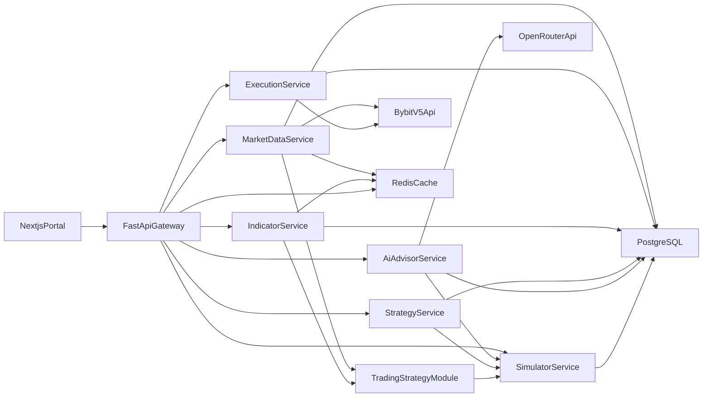

# Trading Portal BRD + Architecture (Spot-First v1)

## 1) Purpose

Define the business requirements and implementation architecture for a local/dev-first automated crypto trading platform with:

- Python + FastAPI backend for market data, indicators, execution, and strategy analysis.
- Next.js frontend for watchlists and charting.
- Bybit v5 API as the initial exchange integration.
- OpenRouter-powered strategy review workflow with simulation safety gates.

This document is intentionally scoped to **Spot trading only** for v1 to reduce risk and speed up delivery.

## 2) Business Objectives

- Build a stable, observable platform for algorithmic trading iteration.
- Reduce manual work in strategy evaluation and parameter tuning.
- Prevent unsafe strategy changes from reaching live trading without simulation review.
- Provide clear chart-based visibility into signals, indicators, and trade outcomes.

## 3) Success Metrics (KPIs)

- **Execution reliability:** >= 99.5% successful order submission attempts (excluding exchange-side rejections).
- **State consistency:** >= 99.9% reconciliation match between local orders/positions and exchange state.
- **Data freshness:** ticker updates visible in UI within 1-2 seconds for active symbols.
- **Indicator latency:** indicator values computed and available within 500 ms after new candle ingest.
- **Strategy cycle speed:** AI suggestion -> simulation -> decision loop completed in < 5 minutes for standard runs.

## 4) Scope

### In Scope (v1)

- Bybit Spot market data ingestion (symbols, tickers, candles via REST; optional websocket later).
- Bybit Spot order lifecycle via REST (place/cancel/query).
- Position and balance tracking for Spot assets.
- Indicator computation and persistence **on the backend**; frontend receives and displays pre-calculated values.
- OpenRouter integration to analyze historical trade results and propose parameter updates.
- Simulation/backtest tool to evaluate proposed strategy changes before approval.
- Next.js portal with:
  - Ticker list, latest price, daily change.
  - TradingView Lightweight Charts rendering.
  - Indicator overlays and baseline shape annotations.

### Out of Scope (v1)

- Perpetual futures and leverage workflows.
- Multi-exchange routing.
- Fully autonomous live deployment of AI-generated strategy updates.
- Complex portfolio optimization across multiple accounts.

## 5) Stakeholders and Users

- **Trader/Operator:** monitors market, reviews strategy outcomes, approves changes.
- **Strategy Developer:** defines indicators and logic, interprets simulation output.
- **System Maintainer:** handles operations, observability, incident response.

## 6) Functional Requirements

### FR-1: Market Data Ingestion (Bybit)

- Fetch and store tradable Spot symbols and metadata.
- Ingest ticker snapshots (last price, 24h change, volume).
- Ingest candles for configured intervals (1m, 5m, 15m, 1h, 4h, 1d).
- Maintain canonical normalized model independent of exchange response shape.
- **Unified Spot market:** All chart data (REST + WebSocket) must use the same Bybit market (Spot) to avoid volume/price mismatches.
- Use Bybit REST for historical bootstrap and symbol catalog:
  - `GET /v5/market/instruments-info` for Spot symbols.
  - `GET /v5/market/kline` (category=spot) for historical candles.
- Use Bybit public WebSocket for realtime updates:
  - `wss://stream.bybit.com/v5/public/spot` with `tickers.{symbol}` for ticker list (last price, 24h change, volume24h).
  - `wss://stream.bybit.com/v5/public/spot` with `kline.{interval}.{symbol}` for chart candle updates.
- **Backend candle merge:** Backend merges REST kline (history) + kline WebSocket (current bar) into a single stream; frontend consumes only the merged candle stream for chart data. Ticker stream is used solely for the ticker list, not for chart bar updates.

### FR-2: Order Execution and Tracking

- Place market/limit Spot orders.
- Cancel open orders.
- Query open and historical orders.
- Persist all order lifecycle transitions (new, partially filled, filled, canceled, rejected).
- Use idempotency keys to avoid duplicate order placement during retries.

### FR-3: Position and Balance Tracking

- Compute synthetic Spot positions from fills/balances.
- Track realized and unrealized PnL per symbol and strategy run.
- Reconcile local state with Bybit account snapshots on schedule.

### FR-4: Indicator Engine

- Compute configured indicators on candle close (e.g., SMA, EMA, RSI, MACD, ATR, VWAP).
- **Volume profile** is computed in the market data pipeline (CandleStreamHub) and streamed with candle snapshot/upsert events; same data is available for strategy and simulation.
- Store values keyed by symbol, timeframe, timestamp, indicator name, and parameter hash.
- Expose indicator series for frontend overlays and for simulation engine.

### FR-5: AI Strategy Review Tool (OpenRouter)

- Input: historical trade results, strategy parameters, indicator performance summary, and constraints.
- Output: structured recommendation payload (parameter deltas, rationale, confidence, risk notes).
- Enforce strict JSON schema response validation.
- Persist all prompts, responses, and model metadata for auditability.

### FR-6: Simulation Tool

- Replay historical candles and strategy logic with candidate parameters.
- Produce projected metrics: net return, max drawdown, win rate, Sharpe-like ratio, trade count.
- Compare candidate vs baseline and generate decision-ready report.
- Feed simulation summary back to AI review loop for iterative improvement.

### FR-7: Frontend Portal (Next.js) — Visualization Only

- **Display-only:** Frontend receives pre-calculated candles, indicators, and trade data from the backend; it does not compute indicators or strategy logic.
- Dashboard with symbol list, latest prices, and daily changes.
- Chart page using Lightweight Charts with:
  - Candle series (from backend stream).
  - Indicator overlays (pre-calculated on backend, e.g. volume profile).
  - Trade markers (entry/exit from execution service).
  - Basic shapes/annotations (lines, rectangles, text).
- Strategy review panel for showing AI suggestions and simulation deltas.

## 7) Non-Functional Requirements

### Reliability and Safety

- Retry policy with bounded exponential backoff for exchange/network failures.
- Dead-letter storage for failed ingestion/execution events.
- Circuit-breaker around external dependencies (Bybit, OpenRouter).
- Default live-trading safeguard: strategy updates require explicit operator approval.

### Performance

- API p95 latency target:
  - Read endpoints <= 250 ms (cached paths).
  - Write/execution endpoints <= 500 ms (excluding exchange round-trip).
- UI chart render should remain interactive for at least 5k visible candles.

### Security

- API keys stored via environment secrets, never in source control.
- Role-gated endpoints for execution and strategy approval actions.
- Immutable audit log for order intents, AI suggestions, approvals, and simulation runs.

### Observability

- Structured logs with correlation IDs per request/strategy run.
- Metrics: ingestion lag, order error rates, reconciliation drift, simulation duration.
- Tracing across API -> worker -> external provider calls.

## 8) Domain Model (Core Entities)

- `Symbol` (exchange, base, quote, status, precision).
- `Candle` (symbol, timeframe, open/high/low/close/volume, closeTime).
- `Ticker` (symbol, lastPrice, change24hPct, volume24h, ts).
- `OrderIntent` (idempotencyKey, strategyId, side, type, qty, price, reason).
- `Order` (exchangeOrderId, status, cumulativeQty, avgPrice, timestamps).
- `Fill` (orderId, price, qty, fee, feeAsset, ts).
- `Position` (symbol, qty, avgCost, marketValue, unrealizedPnl).
- `IndicatorValue` (symbol, timeframe, indicator, paramsHash, value, ts).
- `TradeEvent` (time, barIndex, type, side, price, targetPrice?, initialStopPrice, context) — output of Trading Strategy module; consumed by simulation and live signal modules. `initialStopPrice` is required for any order; `targetPrice` optional for close-on-target.
- `StrategyVersion` (strategyId, version, parameters, indicators, approvalState).
- `SimulationRun` (strategyVersion, datasetRange, metrics, artifacts, verdict).
- `AiSuggestion` (model, inputSummary, proposedChanges, confidence, risks).

## 9) System Architecture

### Architectural Principle: Backend Computation, Frontend Visualization

**All indicator and trade strategy calculations run on the backend.** The frontend is a thin visualization layer and does not compute indicators, signals, or strategy logic.

- **Indicators** (e.g. volume profile, SMA, RSI, order blocks) are computed in the backend market data or indicator pipeline and streamed/served to the frontend.
- **Trade strategy logic** runs exclusively on the backend (paper/live execution, simulation, backtest).
- **Frontend responsibilities:** display candles, indicator overlays, trade markers, and UI controls; stream data via WebSocket/REST; persist user preferences (e.g. chart interval, volume profile window).

This ensures a single source of truth for indicators and strategy state, consistency between chart display and live/simulation logic, and enables future headless or API-only clients.

### Service Responsibilities

- **API Gateway (FastAPI):** auth, request validation, external API contracts, websocket fanout.
- **Market Data Service:** symbol/ticker/candle ingestion, normalization, and indicator computation (e.g. volume profile in CandleStreamHub).
- **Execution Service:** order intent -> exchange execution -> state updates.
- **Indicator Service:** compute and publish indicator time series (single source of truth for strategies and frontend). Indicators are pure computation (OB zones, structure, volume profile, S/R).
- **Trading Strategy Module:** consumes candles and pre-calculated indicators; produces **trade events** (signals) in a unified format. Strategy-agnostic: same output for historic simulation and live signal generation. See *Trading Strategy Module* below.
- **Strategy Service:** parameter versioning, approval workflow, strategy metadata.
- **AI Advisor Service:** OpenRouter calls, schema-validated suggestions, explainability metadata.
- **Simulator Service:** consumes trade events from Trading Strategy; deterministic backtests for baseline vs candidate strategies.

### Trading Strategy Module

The **Trading Strategy** module is the core signal engine. It runs at the backend and is consumed by two modes:

1. **Historic simulation + evaluation** — Simulator replays historical candles, runs strategy, maps trade events to entries/exits, computes PnL and metrics.
2. **Live trade signal generation** — A live runner subscribes to candle stream, invokes strategy on each update, produces `OrderIntent` for applicable events.

The module itself is mode-agnostic: it receives candles and indicators and outputs **TradeEvent[]** (time, type, side, price, context). Simulation and live execution are implemented in separate modules that consume these events.

**Design principles:**
- Indicators (order blocks, structure, volume profile) remain pure computation; no trade logic.
- Bar markers (boundary cross, breaker created) are **trade events** produced by the strategy module, not by indicators. Chart bar markers, when displayed, are derived from strategy output.
- Strategy output format supports both backtest (bar-by-bar replay) and live (event-driven) consumption.

**Module structure:** `backend/app/services/trading_strategy/` — types (`TradeEvent`), strategy implementations (e.g. order-block signals), optional conversion to bar markers for chart display. See `docs/trading-strategy-module-plan.md` for implementation details.

### Runtime Pattern

- FastAPI app for synchronous API.
- Background workers (Celery/RQ/Arq) for polling, reconciliation, indicator jobs, simulations.
- Redis for cache/queues; PostgreSQL for durable state.

## 10) Data Flow

### Candle Stream (Chart Data + Graphics)

1. Frontend subscribes to `WS /api/v1/stream/candles/{symbol}?interval=...&volume_profile_window=2000`.
2. Backend `CandleStreamHub` fetches REST kline (spot), computes indicators (volume profile, order blocks, structure, S/R), builds a **graphics** object, broadcasts snapshot with `candles` and `graphics`.
3. Backend subscribes to Bybit kline WebSocket (spot); for each bar update: replace last candle or append new bar; recompute graphics; on new bar start, refetch REST and broadcast fresh snapshot.
4. `graphics` structure: `{ volumeProfile: {...}, supportResistance: { lines: [...] }, orderBlocks: {...}, smartMoney: { structure: {...} } }`. Order blocks are pure indicator output (OB zones only). Bar markers (boundary cross, breaker), when included, come from the **Trading Strategy** module (trade events → chart markers).
5. Frontend applies snapshot/upsert events; chart renders candles and graphics. No client-side indicator computation.

### Ticker Stream (Ticker List Only)

1. Frontend subscribes to `WS /api/v1/stream/ticks/{symbol}`.
2. Backend proxies Bybit ticker WebSocket; used for last price, volume24h, change% in ticker list. **Not used for chart bar updates.**

### General

1. **Backend** indicator job computes values per configured symbol/timeframe and writes `IndicatorValue`; chart indicators (e.g. volume profile) are computed in the candle stream pipeline and included in stream payloads.
2. **Trading Strategy** consumes candles and indicators and produces `TradeEvent[]`. Simulation and live modules consume these events.
3. **Backend** live signal flow: strategy emits events → mapped to `OrderIntent` → Execution Service submits to Bybit.
3. Order updates and fills are persisted and reflected in positions.
4. Historical trades + indicators feed AI Advisor request.
5. AI Advisor returns schema-valid parameter proposals.
6. Simulator evaluates proposal; results are attached to suggestion.
7. Operator approves/rejects; approved versions can be activated for paper/live modes.

## 11) API Contract Draft (v1)

### Market Data

- `GET /api/v1/symbols` — tradable Spot symbols.
- `GET /api/v1/intervals` — supported kline intervals.
- `GET /api/v1/tickers?symbols=BTCUSDT,ETHUSDT` — 24h snapshots for ticker list.
- `GET /api/v1/candles?symbol=BTCUSDT&interval=1m&limit=300` — historical klines (standalone fetch).
- `WS /api/v1/stream/candles/{symbol}?interval=1&volume_profile_window=2000` — **primary chart stream:** merged snapshot + live bar upserts + pre-calculated indicators (e.g. volume profile).
- `WS /api/v1/stream/ticks/{symbol}` — ticker stream for ticker list only (last price, volume24h, change%); not used for chart bar updates.

### Trading

- `POST /api/v1/orders/intents`
- `POST /api/v1/orders/place`
- `POST /api/v1/orders/{orderId}/cancel`
- `GET /api/v1/orders?symbol=BTCUSDT&status=open`
- `GET /api/v1/positions`

### Strategy + AI + Simulation

- **Strategy data export (frontend):** User downloads bar data, indicators, orders, and trailing stops via "Export for AI" button. The Markdown file with captioned sections is fed to AI for strategy review and improvement proposals.
- `POST /api/v1/strategies/{strategyId}/review`
- `POST /api/v1/strategies/{strategyId}/simulate`
- `GET /api/v1/simulations/{runId}`
- `POST /api/v1/strategies/{strategyId}/versions/{version}/approve`
- `GET /api/v1/ai-suggestions?strategyId=...`

## 12) Frontend Architecture (Next.js + Lightweight Charts)

### Computation Boundary

The frontend **does not** compute indicators, signals, or strategy logic. It:
- Subscribes to backend streams (candles, ticks) and displays data.
- Receives indicator data (e.g. `volumeProfile`) within stream payloads or via dedicated endpoints.
- Renders trade markers and annotations from backend-provided coordinates.

All indicator and strategy calculations run on the backend.

### UI Modules

- `MarketOverview`: watchlist/ticker table with sorting and filtering.
- `ChartWorkspace`: chart container with series, overlays, and annotation primitives.
- `StrategyWorkbench`: AI recommendation and simulation comparison panel.

### Strategy Data Export for AI Review

A **data download control** in the chart/indicators area allows exporting the current view's data for AI review and improvement proposals. The export includes:

1. **Bar data (OHLCV)** — Candle open, high, low, close, volume per bar.
2. **Calculated indicators** — Volume profile, support/resistance levels, order blocks, smart money structure (including candle trend colors).
3. **Trade orders** — Strategy-generated entry signals with price, target, initial stop, and context.
4. **Trailing stop events** — Stop level segments over time (start/end time, price, side).

Each section has a **proper caption** so that an AI can parse the document, understand the strategy context, and propose improvements. The export format is Markdown (`.md`), suitable for pasting into AI chat or feeding to the AI Advisor workflow.

### Strategy Results Calculation (Frontend)

When strategy signals are displayed, the frontend computes **trade outcomes in points** by simulating each trade against the candle data:

1. **Entry:** Entry price = close price of the entry bar (bar at `barIndex`).
2. **Stop hit:** Close price = close of the first bar whose range touches the effective stop level. Stop level is taken from trailing stop segments (or initial stop if no segment covers the bar).
3. **Take profit hit:** Close price = close of the first bar whose range touches the target price (when `targetPrice` is set).

For each trade, the outcome is computed as:
- **Long:** `points = closePrice - entryPrice`
- **Short:** `points = entryPrice - closePrice`

A **Strategy Results** table is rendered below the chart with columns: entry date/time, order type (long/short), close date/time, close reason (stop / take_profit / end_of_data), and difference in points. A summary row shows total points and average points per trade.

### Order Blocks and Swing Labels: Full Data, Frontend Display Control

To simplify data analysis and AI export:
- **Backend** outputs all order blocks and breaker blocks (within lookback); structure returns up to 50 swing labels.
- **Frontend** indicators panel lets the user choose how many to **draw**: Bull OB count, Bear OB count, Swing labels count. Defaults: 5, 5, 15.
- Full data remains available for export and strategy; only the chart rendering is limited.

### State Approach

- Keep top-level pages thin; isolate state in module-level providers and chart-specific components.
- Use server actions or API routes for secure backend communication.
- Stream ticker updates via websocket/SSE where possible.

### Chart and Plugin Strategy

Lightweight Charts does not provide built-in box, line, label, or shape primitives. Drawing is done via **series primitives** (plugins) using `CanvasRenderingContext2D`. Reference indicators (Order Blocks, Support/Resistance) use these Pine graphics objects:

| Pine object | Purpose | LWC approach |
|-------------|---------|--------------|
| **Box** | Order blocks, Fair Value Gaps, volume profile bars | Rectangle Drawing Tool primitive; custom primitive for programmatic boxes |
| **Line** | Structure lines (BOS/CHoCH), S/R horizontals, OB boundaries | Trend Line, Vertical Line primitives; custom for horizontal extend.both |
| **Label** | Swing labels (HH, HL, LH, LL), BOS/CHoCH, EQH/EQL | Anchored Text or custom primitive for price/time-anchored labels |
| **Shape** | Bar markers (triangle, diamond) | `setMarkers()` on series or custom primitive |
| **Volume profile** | Price-level histogram | Official Volume Profile plugin example. **Display:** Must be rendered in **inverse** orientation (bars extend leftward) and positioned **to the right** of the main chart. |
| **Custom candle colors** | 4 colors (bright/dark green, bright/dark red) by trend | Per-point `color`, `wickColor`, `borderColor` on `CandlestickData`; each bar overrides series defaults |

**Official plugin examples** (TradingView): Rectangle Drawing Tool, Trend Line, Vertical Line, Volume Profile, Anchored Text, Bands Indicator. Source: `tradingview.github.io/lightweight-charts/plugin-examples` and `github.com/tradingview/lightweight-charts/plugin-examples`.

**Implementation strategy:**
- Use series primitives for boxes, lines, labels; reuse/adapt official plugins.
- Volume profile: official Volume Profile primitive; displayed in inverse orientation, to the right of the main chart. **Computed on the backend** (indicator engine); frontend only displays pre-calculated data. Uses a configurable **window** (default 2000 bars) with recency weighting: `weight = (window - positionFromNewest) / window`. Window is passed via WebSocket query param and persisted in chart preferences.
- Custom candle colors: set `color`, `wickColor`, `borderColor` per data point in `CandlestickData`; supports 4-way coloring (e.g. swing×internal trend: bright/dark green, bright/dark red).
- **Order blocks and swing labels display limits:** Backend returns **all** order blocks and breaker blocks (within lookback). Structure returns up to 50 swing labels. The **frontend** controls how many to draw via the indicators panel: "Bull" / "Bear" (order blocks to display) and "Swings" (swing labels). This simplifies data analysis and export while keeping the chart readable.
- Status/metric tables: render outside the chart (e.g. sidebar or panel) when needed.
- Keep drawing objects in backend-serializable format (`shapeType`, `points`, `style`, `label`) for reproducibility and auditability.
- **Graphics objects extension:** Backend returns a `graphics` object containing chart primitives. Volume profile remains a specific object (drawn as-is). Generic primitives (e.g. `horizontalLine` for S/R) use a chart-agnostic schema: `{ type, price, width, extend, style }`. Frontend maps each type to Lightweight Charts drawing. See `docs/indicators-support-resistance-plan.md` and `app/schemas/chart_primitives.py`.

## 13) AI Suggestion + Simulation Guardrails

- AI outputs are recommendations, not executable commands.
- Enforce strict JSON schema and reject invalid/partial responses.
- Mandatory simulation before activation of any parameter update.
- Approval gate required for switching active strategy version.
- Maintain rollback to prior strategy version with one-step activation.
- Track overfitting risk with out-of-sample window checks in simulation reports.

## 14) Implementation Roadmap

### Phase 1: Foundation + Market Visibility

- FastAPI skeleton, PostgreSQL/Redis setup, Bybit market data ingestion.
- Next.js portal with ticker list and candle chart.
- Baseline indicators and REST read endpoints.
- Realtime tick bridge from Bybit WebSocket through backend WebSocket to frontend chart.

### Phase 1.1: UI/Feed Wiring

- Symbol switcher in frontend linked to backend market endpoints.
- On symbol change: reconnect candle stream (backend sends fresh snapshot); reconnect ticker stream for ticker list.
- Lightweight Charts integration with candle series from `WS /stream/candles`; optional tick-based OHLC polish for last bar (ticker used only for last price, not volume).
- Chart viewport: call `fitContent()` only when symbol or interval changes, not on every data update, to preserve scroll/zoom position.

### Phase 2: Paper Trading Loop

- Order intent and execution modules (paper mode first).
- Order/position tracking and reconciliation jobs.
- Chart trade markers and annotation persistence.

### Phase 3: Controlled Live Spot Trading

- Live Bybit execution toggle with safety controls.
- Idempotency, retry hardening, and incident monitoring.
- Approval workflow for strategy version activation.

### Phase 4: AI + Simulation Optimization

- OpenRouter integration with structured outputs.
- Simulation comparison reports and strategy proposal UX.
- Feedback loop from simulation results back into AI review prompts.

### Trading Strategy Module (see docs/trading-strategy-module-plan.md)

- Extract bar marker logic from Order Blocks into Trading Strategy module.
- Order Blocks becomes pure indicator; strategy produces `TradeEvent[]`.
- Wire strategy output for chart bar markers (optional); prepare for simulation and live signal consumption.

## 15) Risks and Mitigations

- **API rate limits / outages:** rate-aware scheduler, retries, and fallback caching.
- **Order state drift:** scheduled reconciliation and conflict flags.
- **Backtest/live mismatch:** include slippage/fees assumptions and walk-forward testing.
- **AI overfitting or unsafe suggestions:** enforce constrained parameter bounds, mandatory simulation, human approval.
- **Chart plugin instability:** pin compatible library versions and wrap custom primitives behind internal adapter interfaces.

## 16) Acceptance Criteria

- Document clearly distinguishes v1 must-have from future capabilities.
- Service boundaries, data ownership, and flow are explicit.
- API and domain model are detailed enough for implementation kickoff.
- AI suggestion loop includes strict safety and governance controls.
- Chart architecture maps directly to required overlays and drawing primitives.

